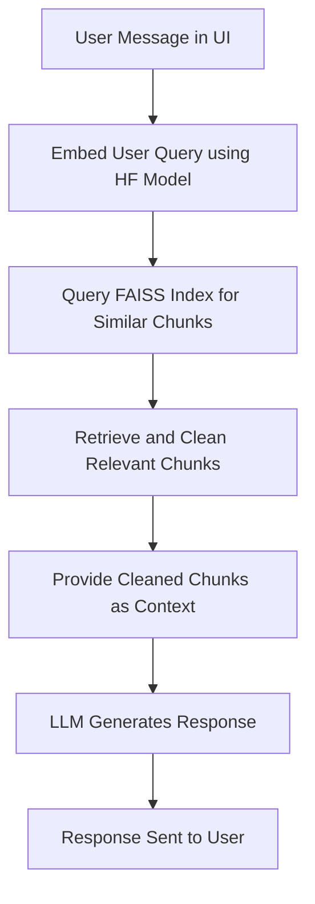

# Approach

This document outlines the approach taken to build the Proof of Concept (POC) for a Retrieval-Augmented-Generation (RAG) chatbot. The focus was on leveraging free and open-source tools, particularly Hugging Face (HF) models, to minimize costs while maintaining functionality. Below is a detailed explanation of the pipeline, the reasoning behind the library choices, and the overall design.

---

## Problem Breakdown and Approach

### 1. **PDF Extraction**
The first step in the pipeline involves extracting structured data from PDF documents. This was achieved using `mineru`, a library designed for extracting content from PDFs in a structured JSON format. The mineru library was chosen because:
- It provides a robust way to extract text blocks, tables, and other structured content.
- The output format aligns well with the ingestion format expected by the chunking algorithm.
- It is free and open-source, making it suitable for a POC.

**Note:** The extraction process is compute-intensive, as it involves parsing and structuring large PDF files. This step is typically run offline to prepare the data for subsequent stages.

---

### 2. **Hierarchical Chunking**
Once the data is extracted, it is processed into smaller, fixed-size text chunks in a hierarchical fashion. The chunking algorithm:
- Breaks the content into sections and subsections based on the document structure.
- Further splits the text into smaller chunks of a fixed size, with some overlap to preserve context.

This hierarchical approach ensures that:
- The chunks are semantically meaningful and retain the context of the original document.
- The chunks are of a manageable size for embedding generation and retrieval.

---

### 3. **Embedding Generation**
For embedding generation, a Hugging Face (HF) embedding model was used. The choice of HF models was driven by:
- Their high-quality, pre-trained models for semantic similarity tasks.
- The availability of free usage through the Hugging Face Inference API, which aligns with the cost constraints of a POC.
- Ease of integration with Python-based pipelines.

The embeddings represent the semantic meaning of each chunk as a high-dimensional vector, which is crucial for efficient similarity search.

---

### 4. **Indexing with FAISS**
The embeddings are indexed and stored using **FAISS** (Facebook AI Similarity Search). FAISS is a library developed by Facebook for fast nearest-neighbor search in high-dimensional spaces. It was chosen because:
- It is highly optimized for large-scale similarity search, making it ideal for handling large document collections.
- It supports various indexing strategies, including inner product and cosine similarity, which are well-suited for embedding-based retrieval.
- It is open-source and widely used in the industry, ensuring reliability and community support.

The FAISS index allows for efficient retrieval of semantically similar chunks based on a query. The indexed embeddings are saved to disk, along with the corresponding chunks, using Python's `pickle` module for later retrieval.

---

### 5. **Chatbot Workflow**
When the chatbot runs:
1. The user query is embedded using the same HF embedding model.
2. The FAISS index is queried to fetch the most semantically similar chunks.
3. The retrieved chunks are cleaned and formatted to serve as the context for the LLM (Large Language Model) call.
4. The LLM generates a response based on the provided context and user query.

This approach ensures that the chatbot can provide accurate and contextually relevant responses by grounding the LLM's output in the retrieved document content.

---

## Summary of Library Choices
- **mineru**: For PDF extraction, due to its ability to produce structured JSON output and its open-source nature.
- **Hugging Face Models**: For embedding generation, due to their high quality, free usage via the Inference API, and ease of integration.
- **FAISS**: For indexing and retrieval, due to its speed, scalability, and suitability for high-dimensional similarity search.

---

## Why FAISS?
FAISS was chosen for this POC because:
- It is designed for fast and scalable similarity search, which is critical for retrieving relevant chunks in real-time.
- It supports GPU acceleration, which can be leveraged for even faster indexing and retrieval in production scenarios.
- It is widely adopted and well-documented, making it a reliable choice for embedding-based retrieval tasks.

---

## Pipeline Flow Diagram

Below is a visual representation of the pipeline flow, from the user message in the UI to the final response generated by the chatbot:

